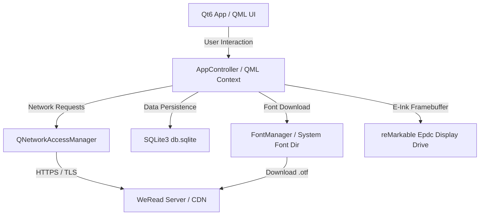
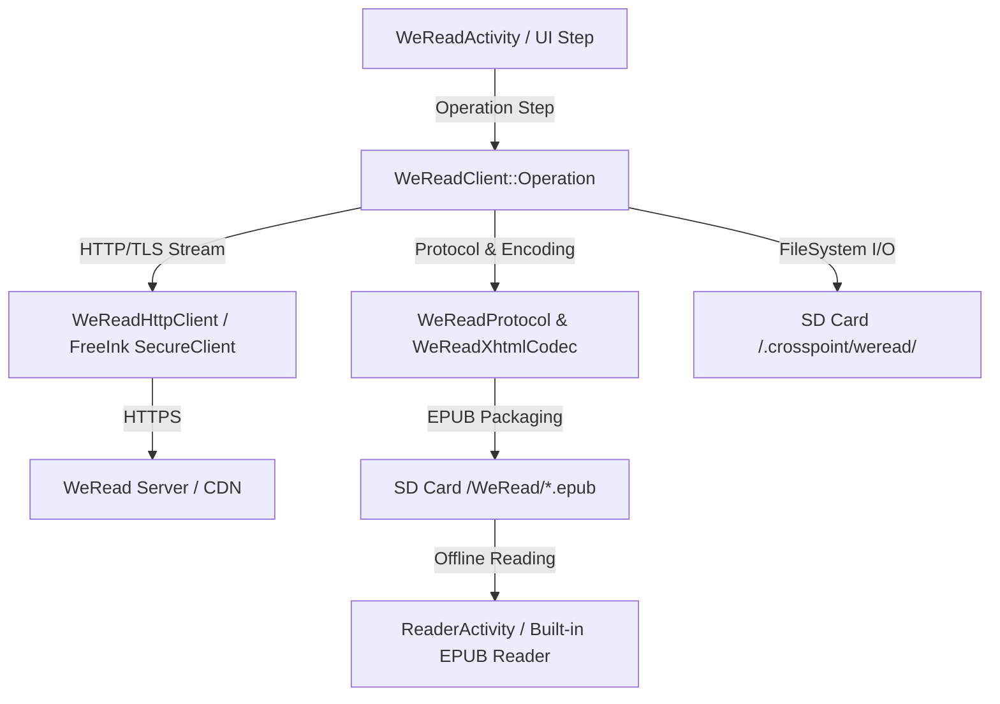
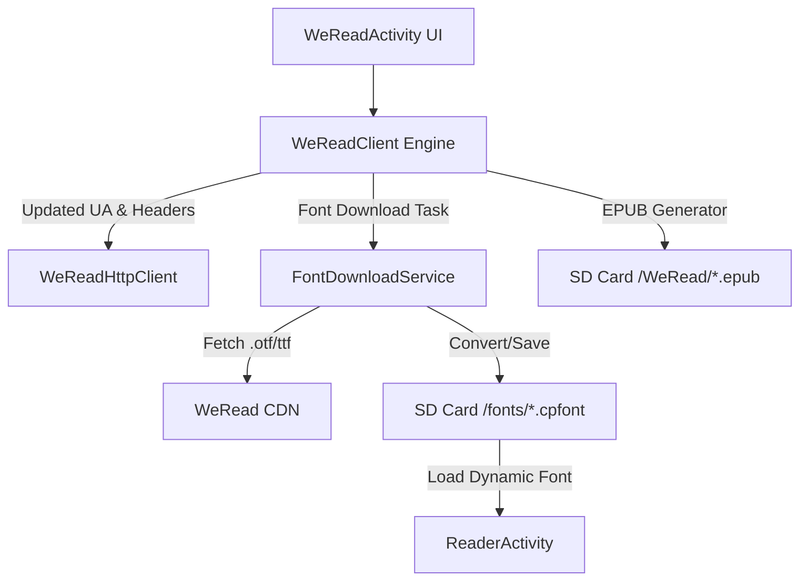

# reMarkable 微信读书应用 (remarkable-weread) 分析与 CrossMux 移植可行性报告

## 1. 概述 (Executive Summary)

微信读书为 reMarkable Linux 墨水屏设备推出了官方原生应用包（`remarkable-weread-v1.0.0-universal-release.zip`）。本报告针对该 64 位 AArch64 Linux 应用程序（基于 Qt 6 / QML）进行了深入逆向与协议分析，并与 CrossMux (ESP32 / FreeRTOS / FreeInk SDK) 现有的 C++ 微信读书模块进行了全方位对比。

### 核心结论
1. **直接运行/二进制移植可行性**：**不可行**。`remarkable-weread` 为 Linux 64 位 AArch64 ELF 动态链接可执行程序，依托 Linux 内核、Qt 6 运行时（QQmlApplicationEngine, QNetworkAccessManager）、SQLite3 以及 reMarkable 专有的 Framebuffer 硬件驱动。ESP32 属于 32 位 Xtensa/RISC-V 架构单片机，运行 FreeRTOS 无 Linux 内核与 Qt 依赖，无法直接执行或加载该二进制。
2. **协议与接口借鉴价值**：**极高**。reMarkable 版与 CrossMux 均使用微信读书的 **Web 端 API 协议**（非 Open SDK），双方在扫码登录流程、书架同步、章节获取等核心 API 上高度重合。reMarkable 版使用了更标准的 User-Agent 标识 (`WeRead/1.0.0 WRBrand/remarkable wr_eink`)，并包含在线 CDN 动态字体下载机制。
3. **架构与功能移植路线**：**源码/功能级移植与重构**。CrossMux 可以借鉴 reMarkable 版的优势特性（如：微信 CDN 在线第三方字体下载、更优化的 User-Agent 伪装、更完善的书架同步机制），并将其原生重构成 CrossMux 现有的 C++ 模块 (`lib/WeReadWebApi` + `src/activities/apps/weread/`)。

---

## 2. 平台与架构对比 (Platform & Architecture Comparison)

| 维度 | reMarkable WeRead (`remarkable-weread`) | CrossMux WeRead (`src/activities/apps/weread`) |
|---|---|---|
| **目标硬件** | reMarkable Paper Pro / Move (AArch64 ARMv8) | ESP32-C3 / ESP32-S3 (Xtensa / RISC-V) |
| **操作系统** | reMarkable OS (Custom Linux 5.4+) | FreeRTOS / ESP-IDF / FreeInk SDK |
| **内存/存储** | 2GB~4GB RAM / 16GB~64GB Flash | 400KB SRAM + 2MB~8MB PSRAM / 4MB~16MB Flash + SD卡 |
| **图形与UI框架** | Qt 6.x (QML / QQmlApplicationEngine / QtQuick) | FreeInk SDK C++ Framebuffer / LVGL / CrossMux Canvas |
| **网络引擎** | `QNetworkAccessManager` + OpenSSL / system trust store | FreeInk `SecureClient` (wolfSSL / mbedTLS) + ESP-HTTP |
| **数据持久化** | SQLite 3 (`/home/root/.local/share/remarkable-weread/db.sqlite`) | SD卡 FAT32 (`/.crosspoint/weread/` 结构化文件 / 二进制 session) |
| **字体支持** | 动态从 WeRead CDN 下载 `.otf` 字体到系统/应用字体库 | 静态内置 8/10/12pt 字体 + SD 卡 `.cpfont` 专用离线字体包 |
| **阅读实现方式**| 运行内嵌 QML HTML 渲染器，在线/本地实时渲染 | 后台下载章节/图片，本地 C++ 打包为标准 `.epub`，由内置 Reader 离线阅读 |

---

## 3. 网络 API 与协议对比 (Network API & Protocol Diff)

reMarkable 版与 CrossMux 均采用微信读书 Web 端 HTTPS 接口。下表列出两者在网络交互上的异同：

| 接口分类 | Endpoint | reMarkable WeRead 实现 | CrossMux WeRead 实现 | 移植/改进建议 |
|---|---|---|---|---|
| **扫码登录** | `GET /web/getuid` | 获取登录 UID & 确认二维码 URL | `WeReadProtocol` 解析 JSON 获取 UID & QrUrl | 保持一致 |
| **轮询登录** | `GET /web/getlogininfo` | 轮询登录状态并获取 `wr_vid`, `wr_skey` Cookie | 轮询 Cookie 并保存至 `session.bin` | 保持一致 |
| **登录确认** | `GET /web/confirm` | 携带 `pf=2&uid=...` 确认设备绑定 | 相同 | 保持一致 |
| **书架同步** | `GET /shelf/sync` | 全量/增量同步书架列表，保存至 SQLite `shelf_entries` | 同步书架并更新 SD 卡 `shelf.json` | 增加增量 Synckey 校验 |
| **书籍详情** | `GET /shelf/syncbook` 或 `/book/info` | 获取书籍元数据（标题、作者、封面图、更新时间） | 获取详情并缓存缩略图至 `cover.v2.bmp` | 保持一致 |
| **章节目录** | `GET /book/chapterInfos` | 拉取全书章节目录及免费/付费标记 | 拉取章节目录并生成 SD 卡 `toc.bin` | 保持一致 |
| **章节正文** | `GET /book/chapterdownload` / `/book/read` | 实时拉取章节内容并在 QML 视图中展示 | 拉取 Base64/XHTML 正文并解码转存 | 保持一致 |
| **进度同步** | `GET/POST /book/getProgress` | 实时上传/拉取阅读进度 (`chapterUid`, `chapterOffset`) | 手动/退出阅读器时上报阅读时长与章节位置 | 保持一致 |
| **网络 User-Agent** | `User-Agent` Header | `WeRead/1.0.0 WRBrand/remarkable wr_eink` | `CrossPoint-ESP32-<VERSION>` | **推荐改用官方墨水屏设备 UA** |
| **在线字体 CDN** | `https://weread-1258476243.file.myqcloud.com/` | 从腾讯云 CDN 下载思源宋体、仓耳今楷等字体 | 仅支持本地 `.cpfont` 字体 | **新增在线字体下载与转换功能** |

### 3.1 C++ 核心 API 客户端符号方法比对 (`WereadApiClient` vs `WeReadClient`)

通过对 reMarkable 二进制程序 `remarkable-weread` 的 C++ 符号逆向分析，其 API 客户端核心类为 `WereadApiClient`：

| 功能模块 | reMarkable C++ 符号方法 (`WereadApiClient`) | CrossMux C++ 方法 (`WeReadClient` / `WeReadProtocol`) | 详细行为对比 |
|---|---|---|---|
| **请求登录 UID** | `requestLoginUid()` | `fetchLoginUid()` | 均调用 `GET /web/getuid`。获取 UID 后生成扫码确认 URL (`https://weread.qq.com/web/confirm?pf=2&uid=...`)。 |
| **轮询登录状态** | `pollLoginInfo(vid)` | `pollLogin()` | 均轮询 `GET /web/getlogininfo`。reMarkable 版保存 `wr_vid, wr_skey, wr_ql, wr_rt`；CrossMux 保存 `wr_vid, wr_skey, wr_rt` 至 SD 卡 `session.bin`。 |
| **会话校验与刷新**| `validateSession()` / `renewSession()` | `renewSession()` | reMarkable 应用启动时主动触发 `validateSession` 校验 Cookie 有效性，失效时自动 `renewSession`。 |
| **全量/增量书架** | `syncShelf(synckey)` | `syncShelfOnce()` | 调用 `GET /shelf/sync`，携带 `synckey` 游标。返回 `books` 数组及最新 `synckey`。 |
| **书架 ID 列表同步**| `syncShelfIds()` | *(直接全量/按页拉取)* | reMarkable 增设 `syncShelfIds` 同步所有在线 `bookId` 集合，对照本地 SQLite 补全缺失书籍。 |
| **章节与批量下载**| `downloadChapter(bookId, chapterUid, ...)` | `fetchReaderOnce()` / `fetchShardOnce()` | reMarkable 支持多章节分包压缩下载（存入 SQLite `chapter_download_batches`）；CrossMux 逐章拉取 Base64/XHTML，流式解密打成 SD 卡无密 `.epub` 文件。 |
| **图片/资源拉取** | `downloadReaderImage(url)` | `downloadNextImage()` | reMarkable 拉取原始图片并在 QML 中渲染；CrossMux 提取图片并转为 112×164 BMP 缩略图以适应 ESP32 内存。 |
| **阅读进度与时长**| `fetchProgress(bookId)` / `reportRead(...)` | `fetchProgressOnce()` / `sendProgressOnce()` | reMarkable 包含 5 个参数：`chapterUid, chapterIdx, chapterOffset, readingTime, progress`；CrossMux 在退出阅读或手动同步时上报。 |

---

## 4. 架构设计与流程图 (Mermaid Diagrams)

### 4.1 reMarkable WeRead 整体架构 (Qt/Linux)



### 4.2 CrossMux WeRead 现行架构 (ESP32/FreeRTOS)



### 4.3 建议移植增强后的 CrossMux 架构



---

## 5. 可移植功能与 CrossMux 实施路线图 (Actionable Roadmap)

为了将 reMarkable 微信读书应用的优势特性融合到 CrossMux 中，建议按以下 3 个阶段进行实施：

### 阶段 1：协议与网络层优化 (Protocol Modernization)
1. **更新 User-Agent 与请求头**：
   - 将 `WeReadHttpClient` 中的默认请求头更新为 reMarkable 版使用的专用墨水屏标识：
     `User-Agent: WeRead/1.0.0 WRBrand/remarkable wr_eink`
   - 这能有效降低 Web 端 API 针对标准浏览器或自定义 User-Agent 的风控与拦截风险。

### 阶段 2：在线字体动态下载与管理 (Online Font Downloading)
1. **接入微信读书官方 CDN 字体源**：
   - reMarkable 包中使用的 CDN 域名为：`https://weread-1258476243.file.myqcloud.com/`
   - 可在 CrossMux 的 **设置 -> 阅读器字体管理** 或 **微信读书设置** 中新增在线字体下载功能。
2. **下载与 SD 卡缓存流**：
   - ESP32 通过 `WeReadHttpClient` 分片下载思源宋体、仓耳今楷等字体文件（`.otf` 或 `.ttf`）。
   - 将下载的字体流式保存至 SD 卡 `/fonts/` 目录，并调用 CrossMux 的 `.cpfont` 转换工具或直接利用 FreeInk 字体引擎加载。

### 阶段 3：书架管理与 UI 增强 (Bookshelf & UI Enhancements)
1. **优化书架同步与状态恢复**：
   - 借鉴 reMarkable 版在离线与在线状态切换时的逻辑，完善 CrossMux 的书架按页增量缓存与错误重试。
2. **状态提示与排版**：
   - 借鉴 reMarkable 版在下载/字体下载时的状态面板 (StatusPanel) 提示设计，优化 CrossMux 在 E-ink 屏幕上的进度与状态显示。

---

## 6. 微信读书 Web API 完整接口解析列表 (Complete WeRead Web API Reference)

基于对 reMarkable 二进制应用 (`remarkable-weread`) 逆向工程与 CrossMux 抓包分析，整理出微信读书墨水屏 / Web 端使用的完整 API 接口文档：

### 6.1 身份认证与登录接口 (Authentication)

#### 1. 获取登录二维码与临时 UID (`GET /web/getuid`)
* **Endpoint**: `https://weread.qq.com/web/getuid`
* **Method**: `GET`
* **Headers**:
  * `User-Agent`: `WeRead/1.0.0 WRBrand/remarkable wr_eink`
* **Response Payload (JSON)**:
  ```json
  {
    "uid": "12345678",
    "token": "tmp_token_xyz"
  }
  ```
* **客户端处理**: 拿到 `uid` 后生成二维码供微信扫码：`https://weread.qq.com/web/confirm?pf=2&uid=<uid>`。

#### 2. 轮询扫码状态与换取 Session (`GET /web/getlogininfo`)
* **Endpoint**: `https://weread.qq.com/web/getlogininfo`
* **Method**: `GET`
* **Query Parameters**:
  * `uid`: 阶段 1 获取的临时 UID
* **Response Headers (Set-Cookie)**:
  * `wr_vid`: 用户微信读书 VID (例如 `12345678`)
  * `wr_skey`: 会话 Key (例如 `AbCdEf12`)
  * `wr_rt`: Refresh Token
  * `wr_name`, `wr_avatar`: 账号昵称与头像 URL
* **Response Payload (JSON)**:
  ```json
  {
    "succeed": 1,
    "vid": 12345678
  }
  ```

#### 3. 会话校验与 Refresh (`GET /web/renewSession`)
* **Endpoint**: `https://weread.qq.com/web/renewSession`
* **Method**: `GET`
* **Cookies**: `wr_vid`, `wr_skey`, `wr_rt`
* **作用**: 当服务端返回 Session Expired 错误时，客户端携带 `wr_rt` 自动刷新 `wr_skey` Cookie，无需重复扫码。

---

### 6.2 书架与书籍元数据接口 (Bookshelf & Metadata)

#### 4. 全量/增量书架同步 (`GET /shelf/sync`)
* **Endpoint**: `https://weread.qq.com/shelf/sync`
* **Method**: `GET`
* **Query Parameters**:
  * `synckey`: 当前本地最高同步 Key (首次传 `0`)
* **Cookies**: `wr_vid`, `wr_skey`
* **Response Payload (JSON)**:
  ```json
  {
    "synckey": 1700000000,
    "books": [
      {
        "bookId": "832208",
        "title": "三体",
        "author": "刘慈欣",
        "cover": "https://weread-1258476243.file.myqcloud.com/...",
        "version": 1,
        "format": "epub",
        "totalWords": 300000
      }
    ]
  }
  ```

#### 5. 书籍批量详情同步 (`GET /shelf/syncbook`)
* **Endpoint**: `https://weread.qq.com/shelf/syncbook`
* **Method**: `GET`
* **Query Parameters**:
  * `bookIds`: 逗号分隔或 JSON 数组字符串 (`["832208", "123456"]`)
* **Cookies**: `wr_vid`, `wr_skey`
* **作用**: 用于离线书架补齐、获取高清封面 URL、书籍付费类型 (`payType`)、最大免费章节 (`maxFreeChapter`) 及完结状态 (`finished`)。

---

### 6.3 章节与正文拉取接口 (Chapter & Content)

#### 6. 拉取章节目录 (`GET /book/chapterInfos`)
* **Endpoint**: `https://weread.qq.com/book/chapterInfos`
* **Method**: `GET` / `POST`
* **Query Parameters / Payload**:
  * `bookId`: 书籍 ID
* **Cookies**: `wr_vid`, `wr_skey`
* **Response Payload (JSON)**:
  ```json
  {
    "data": [
      {
        "chapterUid": 1,
        "chapterIdx": 1,
        "title": "第一章 科学边界",
        "wordCount": 5000,
        "paid": 0
      }
    ]
  }
  ```

#### 7. 章节正文下载与可逆置换解密 (`GET /book/chapterdownload` 或 `/book/read`)
* **Endpoint**: `https://weread.qq.com/book/chapterdownload`
* **Method**: `GET`
* **Query Parameters**:
  * `bookId`: 书籍 ID
  * `chapterUid`: 目标章节 UID
* **Cookies**: `wr_vid`, `wr_skey`
* **核心加解密算法（Reversible Character Shuffle Algorithm）说明**:
  微信读书章节正文返回的是通过 Base64-URL 编码且字符位置被洗牌乱序的数据流。客户端解码与解密算法步骤如下：
  1. **提取尾部校验字节 (Tail Extraction)**:
     计算 `expectedTail = min(4, ceil((encodedLength + 9) / 10))`。从密文末尾提取 `expectedTail` 字节。
  2. **构造位置置换数组 (Swap Array Generation)**:
     遍历尾部字节，对每个字节的 bit 执行 `transformed += (bit & 1) << (2 * bit)` 位变换，将得到的数值按十进制字符串拼接。取模 `modulus = encodedLength - expectedTail - 2`，两两组对生成最多 10 组位置交换索引对 `(swap_pos_1, swap_pos_2)`。
  3. **还原字符位置 (Character Unshuffle)**:
     按照生成的交换对逆向交换密文中的字符位置，恢复原始 Base64 顺序。
  4. **Base64-URL 解码**:
     使用标准 Base64-URL (`-` 替换 `+`, `_` 替换 `/`) 解码，得到解密后的原始 XHTML / HTML 章节正文。

### 6.4 请求签名与哈希算法 (Request Signing & Hash Algorithms)

#### 8. 查询参数签名算法 (`signQuery`)
微信读书部分客户端 API 请求需要对 Query String 进行自定义哈希签名（`signQuery`），算法逻辑如下：
```cpp
// 对 query 字符串进行双指针位异或签名计算
uint64_t a = 0x15051505;
uint64_t b = a;
size_t i = strlen(query);
while (i > 1) {
  uint8_t current = query[i - 1];
  uint8_t previous = query[i - 2];
  a = (a ^ ((uint64_t)current << ((length - i + 1) % 30))) & 0x7fffffff;
  b = (b ^ ((uint64_t)previous << ((i - 1) % 30))) & 0x7fffffff;
  i -= 2;
}
snprintf(out, outSize, "%llx", a + b); // 返回十六进制签名串
```

#### 9. 书籍与章节 ID 哈希签名算法 (`encodeId`)
微信读书使用由 3 轮 MD5 拼接构成的 ID 混淆映射算法（用于 URL 和客户端数据校验）：
1. 计算输入字符串的 MD5 哈希 `md5_1`；
2. 提取 `md5_1` 的前 3 个字符作为前缀，结合 MD5 生成规则计算中间散列 `md5_2`；
3. 取 `md5_2` 的前 20 个字符，结合第三轮 MD5 计算最终的唯一标识映射。

---

### 6.4 阅读进度与时长同步接口 (Progress & Reading Time)

#### 8. 获取云端阅读进度 (`GET /book/getProgress`)
* **Endpoint**: `https://weread.qq.com/book/getProgress`
* **Method**: `GET`
* **Query Parameters**: `bookId`
* **Response Payload (JSON)**:
  ```json
  {
    "bookId": "832208",
    "chapterUid": 5,
    "chapterOffset": 120,
    "progress": 35,
    "updateTime": 1700001234,
    "appId": "wr_eink"
  }
  ```

#### 9. 上报阅读进度与时长 (`POST /book/getProgress` 或 `/book/reportRead`)
* **Endpoint**: `https://weread.qq.com/book/getProgress`
* **Method**: `POST`
* **Payload (JSON)**:
  ```json
  {
    "bookId": "832208",
    "chapterUid": 5,
    "chapterIdx": 5,
    "chapterOffset": 120,
    "readingTime": 300,
    "progress": 35,
    "appId": "wr_eink"
  }
  ```

---

### 6.5 划线与热门书评接口 (Highlights & Reviews)

#### 10. 拉取热门划线与书评 (`GET /web/book/bookmarklist` / `/web/review/list`)
* **Endpoint**: `https://weread.qq.com/web/book/bookmarklist`
* **Method**: `GET`
* **Query Parameters**: `bookId`
* **Cookies**: `wr_vid`, `wr_skey`
* **作用**: 返回全网热门划线、个人划线及前 50 条热门书评。

---

### 6.6 字体与图片 CDN 接口 (CDN Storage)

#### 11. 在线动态字体拉取
* **Base URL**: `https://weread-1258476243.file.myqcloud.com/resources/fonts/`
* **资源列表**:
  * `NotoSansCJKsc-Regular.otf` (思源黑体)
  * `SourceHanSerifSC-Regular.otf` (思源宋体)
  * `CangErJinKai.ttf` (仓耳今楷)
  * `CangErYunHei.ttf` (仓耳云黑)
  * `CangErXuanSan.ttf` (仓耳玄三)

---

## 7. 总结 (Conclusion)

reMarkable 微信读书应用为我们提供了官方墨水屏客户端在 API 调用、请求头伪装以及在线字体 CDN 分发方面的宝贵经验。虽然由于操作系统与硬件架构的差异无法直接运行其 Linux 二进制，但 CrossMux 能够以**协议升级 + C++ 原生重构**的方式，将 reMarkable 版的优秀特性（尤其是官方 User-Agent 和在线 CDN 字体）完美融合到 ESP32 固件中。
